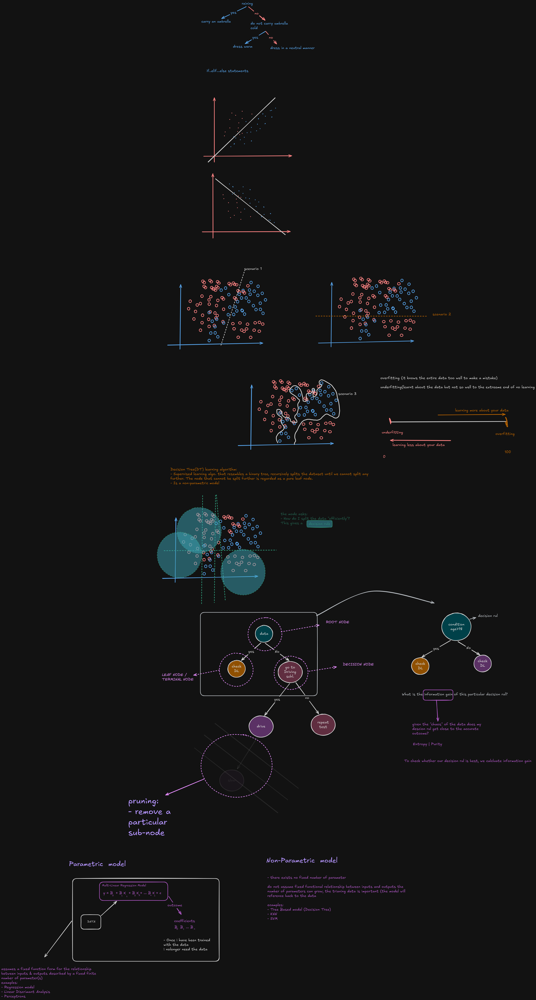
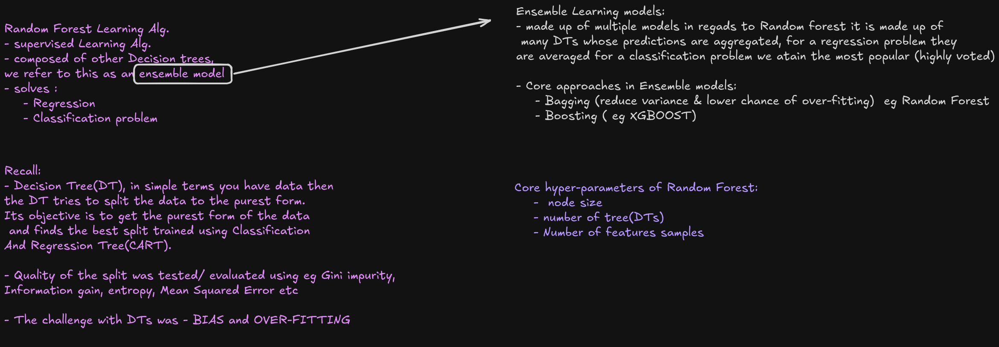
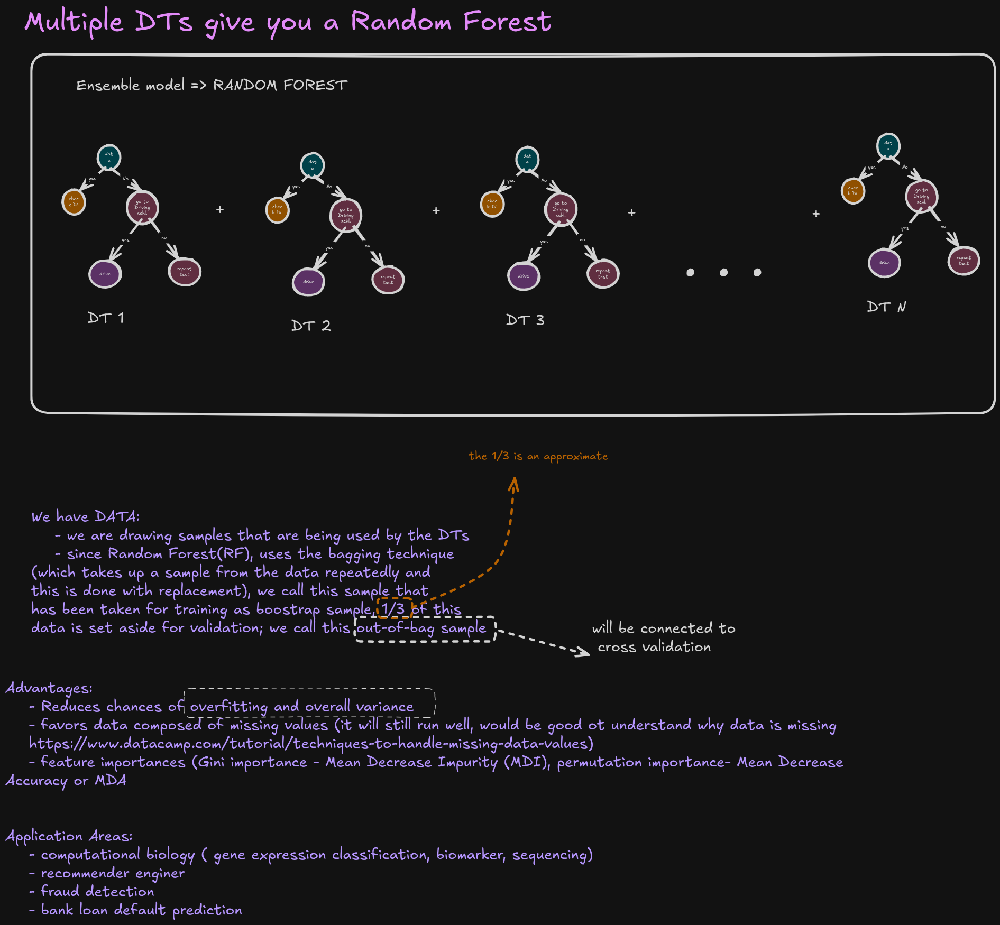
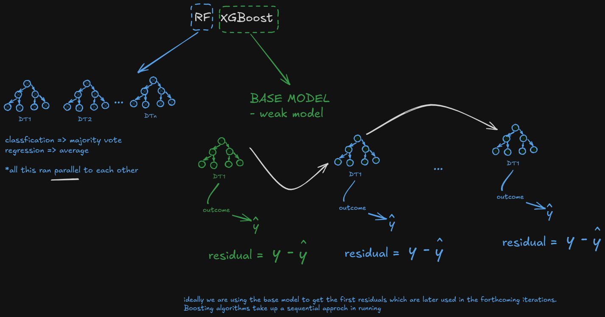
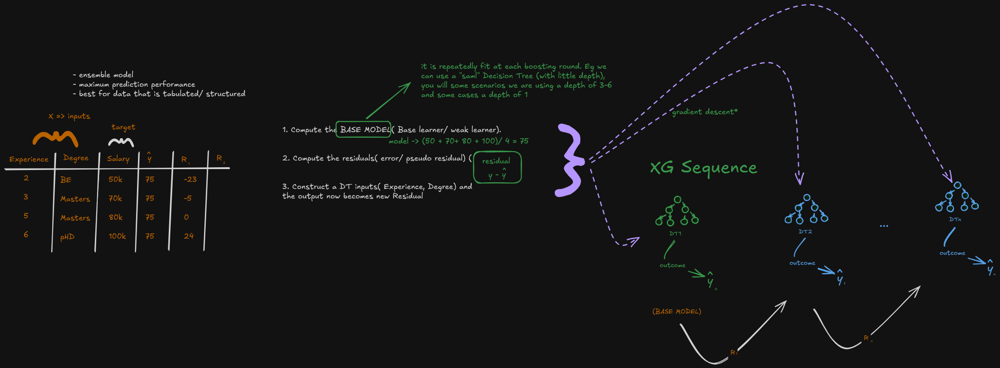
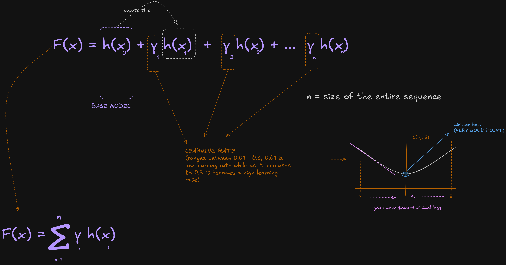
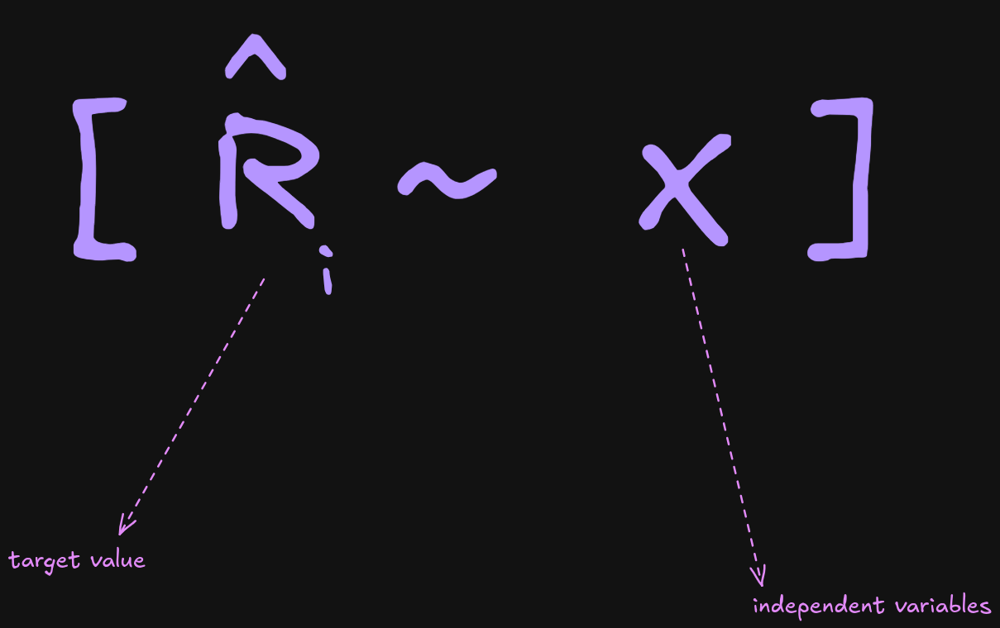
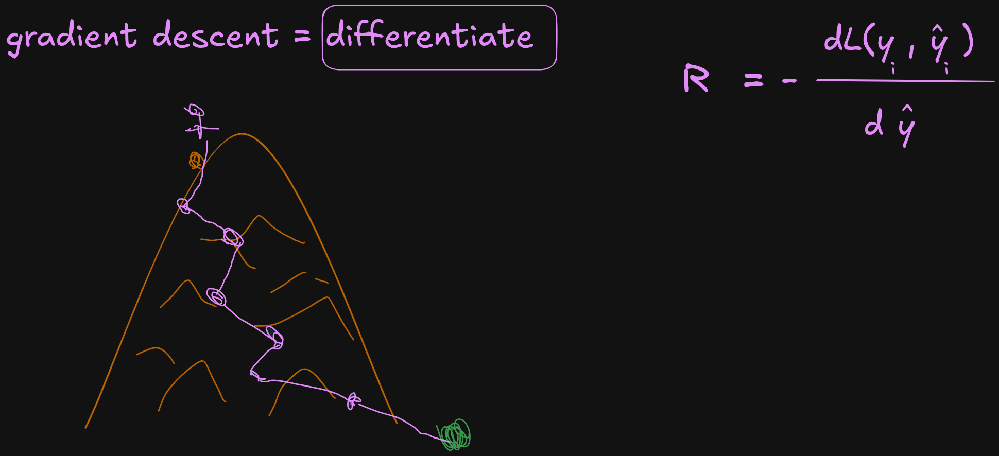

# Start here
- [Download Python from here ](https://www.python.org/downloads/)
- We create **virtual environment** with the aim of isolating your python projects. There other techniques of isolationg your projects:
    - Docker
    - Kubernetes

## creating a virtual Environment: 
- create folder > open the folder on visual studio
- open terminal via visual studio
- run this: `python -m venv env` , kindly note `env` is the name of your environment
- to activate the environment:
    - on windows: 
        - approach one:
            - open `command prompt` on vs code
            - navigate to envrionment folder i.e `env` > open the `Scripts`
            - find `activate.bat` file 
            - click...hold and drag to the terminal space
            - press enter

        - approach 2: 
            - open `command prompt` on vs code
            - run this: `.\env\Scripts\activate.bat` 
            - press enter

    - for linux/ macos:
            - open terminal on vs code
            - run: `source env/bin/activate`

## Finally:
- Create a `.gitignore` file : it makes sure that you only version control what is meant to be version controlled


- install `scikit-learn`: `pip install -U scikit-learn` (make sure your environment is activated)

- install seaborn: `pip install seaborn`


## Linear Regression


## Descision Trees(DT)

<details>
<summary>Class Visuals</summary>


<!-- 
 -->

</details>

<details>
<summary>Notes</summary>

## 1. Warm-up: decision logic as a tree

Before formalizing, decision trees are just nested `if / elif / else` logic, visualized as a graph.

**Example: should I carry an umbrella?**

```
Is it raining?
├── yes → carry an umbrella
└── no  → do not carry umbrella, dress warm
           ├── ...is it cold? → dress warm
           └── ...else        → dress in a neutral manner
```

This is the intuition a decision tree formalizes: a sequence of yes/no (or true/false) questions that narrow down to an outcome.

---

## 2. What is a Decision Tree (DT)?

A **Decision Tree** is a supervised learning algorithm that resembles a binary tree. It **recursively splits the dataset** until no further split is possible.

- A node that cannot be split further is called a **pure leaf node**.
- DTs are a **non-parametric model** (see §6).

### Tree terminology

| Term | Meaning |
|---|---|
| **Root node** | The starting node - represents the whole dataset before any split |
| **Decision node** | An internal node that applies a condition (e.g. `age > 18`) and branches |
| **Leaf / terminal node** | A node that is not split further - gives the final outcome |
| **Decision rule** | The condition used to split a node (e.g. `age > 18`) |

**Example: "can I get a driver's license?"**

```
                    condition: age > 18
                    /                  \
                 yes                    no
                  /                       \
          check driving license    check driving license
             /            \              /            \
          yes             no          yes              no
      go to driving    (repeat      drive           go to driving
        school          test)                          school
```

Each ellipse = a node. Each branch = the outcome of applying the decision rule at the node above it.

---

## 3. How does the model choose a split?

At every node, the model effectively asks:

> **"How do I split the data efficiently?"**

This is answered by a **decision rule** - a threshold or condition on one feature (e.g. `age > 18`) - chosen to best separate the data.

To judge whether a decision rule is *good*, we ask:

> **"Given the 'chaos' of the data, does my decision rule get close to the accurate outcome?"**

This is measured using:

- **Entropy** (or **Gini impurity**) - a measure of "chaos" / impurity in a node
- **Information Gain** - how much entropy is reduced by applying a given decision rule

**To check whether a decision rule is the best one, we calculate its information gain** and compare it against the alternatives - the rule with the highest information gain is chosen at that node.

---

## 4. Overfitting vs. Underfitting

Two failure modes, sitting at opposite ends of "how much the model learns from the data":

| | Underfitting | Overfitting |
|---|---|---|
| **What's happening** | Model has learned too little about the data - barely better than no learning at all | Model has learned the training data *too* well, including its noise - "knows the entire data too well to make a mistake" |
| **Symptom** | Poor performance even on training data | Great performance on training data, poor performance on new/unseen data |
| **Direction on the spectrum** | "Learning less about your data" | "Learning more about your data" |

```
underfitting  <────────────────────────────────────→  overfitting
    0%              (sweet spot)                        100%
       learning less about your data   learning more about your data
```

> **Note for next pass:** this spectrum is a useful intuition, but it's worth pairing with a concrete knob - e.g. `max_depth` or `min_samples_leaf` in a decision tree - so students see *what* is actually moving them along this axis, rather than treating it as an abstract dial.

**Scenarios sketched in class (1, 2, 3):** these were meant to be worked examples of the same dataset fit at different tree depths - a good one to build out fully next time to make the curve concrete rather than abstract.

---

## 5. Pruning

**Pruning** = removing a particular sub-node (branch) from a fully grown tree.

- Purpose: combat overfitting by simplifying the tree after it's built (or limiting its growth as it's built).
- A fully unpruned tree tends to overfit; pruning trades a little training accuracy for better generalization.

---

## 6. Parametric vs. Non-Parametric models

### Parametric models
- Assume a **fixed function form** for the relationship between inputs and outputs, described by a **fixed, finite number of parameters**.
- Once trained on the data, the model **no longer needs the data** - everything it learned is compressed into those fixed parameters.

**Examples:**
- Regression models (e.g. Multi-Linear Regression: `y = B₀ + B₁X₁ + B₂X₂ + ... + BₙXₙ + ε`)
- Linear Discriminant Analysis
- Perceptrons

### Non-parametric models
- **No fixed number of parameters** - the model does not assume a fixed functional relationship between inputs and outputs.
- The number of "parameters" (effectively) can grow with the data. The training data itself stays important - the model references back to it.

**Examples:**
- Tree-based models (Decision Trees)
- KNN
- SVM

> **Flag to double-check:** Naive Bayes was grouped with non-parametric models in the sketch, but it's usually classified as **parametric** - it estimates a fixed set of parameters (class priors + per-feature likelihood parameters) that doesn't grow with more training data, unlike KNN or decision trees. Worth revisiting/moving it, or noting the classification is debated if you want to keep it as a discussion point.
>
> SVM's classification as non-parametric is also somewhat contested (defensible for kernel SVMs where support vectors can scale with data, less so for a plain linear SVM) - might be worth a one-line caveat when presenting.

---

## Suggested flow for next time
1. If/elif/else -> tree intuition (umbrella example)
2. Formal tree terminology (root / decision / leaf / decision rule)
3. How splits are chosen (entropy, information gain)
4. Over/underfitting, tied to a concrete hyperparameter
5. Pruning as the fix
6. Parametric vs. non-parametric, with the corrected examples above
</details>


<hr>
<hr>

## Random Forest 
<details>
<summary>Class Visuals</summary>




# Introduction to Random Forest

## 1. Where Random Forest fits: DT → RF → XGBoost

Random Forest sits between a single decision tree and boosting methods like XGBoost:

| Model | Idea | Weakness it fixes |
|---|---|---|
| **Decision Tree (DT)** | A single tree splits data on feature thresholds | Prone to overfitting — high variance, unstable to small changes in data |
| **Random Forest (RF)** | Many DTs trained in **parallel** on randomized samples, combined by majority vote (classification) or averaging (regression) | Fixes overfitting by averaging away the noise of any one tree |
| **XGBoost** | Many shallow DTs trained **sequentially**, each correcting the previous ensemble's errors | Squeezes out further accuracy by learning from mistakes rather than just averaging randomness |

Random Forest is a **bagging** method (short for **b**ootstrap **agg**regat**ing**) — this is the key structural difference from boosting: *all of a Random Forest's trees are grown independently and could, in principle, be trained at the same time in parallel.* Nothing about tree 2 depends on what tree 1 got wrong.

---

## 2. Why a single decision tree isn't enough

A single decision tree fit to its training data tends to be a **weak, unstable model**:

- It can grow deep enough to memorize noise in the training set — a classic overfitting problem.
- Small changes in the training data can produce a completely different tree structure — this is called **high variance**.

Random Forest's whole purpose is to take many such unstable, overfit-prone trees and combine them in a way that cancels out their individual noise while keeping their collective signal.

---

## 3. How Random Forest actually builds its trees (bagging + feature randomness)

Random Forest introduces **two separate sources of randomness**, and both matter:

### a) Bootstrap sampling (row randomness)
For each tree, a random sample of the training rows is drawn **with replacement** — meaning the same row can be picked more than once, and some rows may not be picked at all for a given tree. Each tree therefore sees a slightly different version of the dataset.

> **A subtlety worth flagging to students:** because sampling is *with replacement*, there is a real chance of the same data point repeating within one tree's bootstrap sample. This is intentional — it's what makes each tree's view of the data meaningfully different from the others, which is the whole source of the "averaging cancels noise" effect. Sampling *without* replacement would just give every tree nearly the same dataset, defeating the purpose.

### b) Random feature subsets (column randomness)
At each split within each tree, Random Forest doesn't consider all available features — it randomly selects a **subset** of features and only searches for the best split among those. This decorrelates the trees from each other: if one feature were extremely predictive, every tree in a forest without this randomness would tend to split on it first, making the trees very similar (and correlated errors don't average away as well as independent ones).

Together, these two mechanisms mean each tree in the forest is trained on a different sample of rows *and* is restricted to different feature subsets at each split — producing an ensemble of trees that each make somewhat different mistakes.

---

## 4. Combining the trees: majority vote or averaging

Once all trees are trained (independently, in parallel), Random Forest combines their outputs very simply:

- **Classification →** majority vote across all trees' predicted classes
- **Regression →** average of all trees' predicted values

**Worked example (regression):** four trees predict salary as 50k, 70k, 80k, and 100k for the same input. The forest's final prediction is simply:

$$\text{model} \rightarrow \frac{50 + 70 + 80 + 100}{4} = 75$$

No weighting, no sequential correction — just a plain average (or vote). This simplicity is part of what makes Random Forest easy to reason about and hard to misconfigure compared to boosting.

---

## 5. Why averaging fixes overfitting

Each individual tree may be a noisy, overfit model of *its own* bootstrap sample. But because each tree's noise comes from a different random sample and different feature subset, the errors tend to be somewhat independent of each other. When you average many such trees:

- The **individual noise cancels out** (errors in different directions partially offset each other).
- The **shared underlying signal reinforces** (since every tree is still fundamentally learning the same real patterns in the data).

This is the core statistical justification for bagging: averaging over many high-variance, low-bias models produces a lower-variance, still-low-bias combined estimator — provided the individual models are not too correlated with each other, which is exactly what the row and feature randomness are designed to ensure.

---

## 6. Random Forest vs. XGBoost — the key structural contrast

| | Random Forest | XGBoost |
|---|---|---|
| Training | Parallel — trees don't depend on each other | Sequential — each tree depends on the previous ensemble's residuals |
| Goal of ensembling | Reduce **variance** (average away noise) | Reduce **bias** (correct systematic errors round by round) |
| Combining trees | Simple vote / average | Weighted sum, scaled by a learning rate |
| Typical tree depth | Often deeper (trees can be fairly expressive individually) | Deliberately shallow (weak learners by design) |
| Sensitivity to hyperparameters | Relatively forgiving — good results with defaults | More sensitive — learning rate, depth, and regularization all matter |

Both are ensemble methods, and both are strong choices for tabular/structured data. Random Forest is often the simpler, more robust starting point; XGBoost tends to squeeze out further accuracy once you're willing to tune it.

---

## 7. Key hyperparameters

| Parameter | Role |
|---|---|
| `n_estimators` | Number of trees in the forest — more trees generally help (up to a point of diminishing returns), and unlike boosting, more trees don't increase overfitting risk |
| `max_depth` | How deep each individual tree can grow |
| `max_features` | Size of the random feature subset considered at each split |
| `min_samples_split` / `min_samples_leaf` | Minimum data required to split a node / to form a leaf — controls how fine-grained each tree's splits get |
| `bootstrap` | Whether sampling is done with replacement (the standard, defining behavior of Random Forest) |

**A practical note worth remembering:** unlike boosting, adding more trees to a Random Forest essentially never hurts — it just costs more compute. This is a direct consequence of trees being independent rather than sequential; there's no "overfitting to residuals" mechanism for extra trees to fall into.

---

## 8. Why Random Forest, specifically

- **Ensemble model, best for a strong baseline with minimal tuning** — Random Forest tends to perform reasonably well out of the box, without the careful hyperparameter tuning that boosting methods often need.
- **Best suited to tabular/structured data**, same as XGBoost — this is a shared strength of tree-based ensemble methods generally.
- **More robust to overfitting for a given tree depth**, since averaging over many independent trees is a more forgiving mechanism than sequential residual correction, which can chase noise if left unchecked (i.e., trained for too many rounds without early stopping).
- **Naturally parallelizable**, which can matter for training speed on large datasets when compute is distributed across cores or machines.

---

*Companion note: this summary mirrors the structure of the XGBoost introduction so the two can be read side by side — same DT→RF→XGBoost framing, same worked-example style, and the same hyperparameter/diagnostics sections for easy comparison.*

</details>


## XG-BOOST

<details>

<summary> XG-Boost Class Illustrations </summary>








# Introduction to XGBoost

## 1. Where XGBoost fits: DT → RF → XGBoost

XGBoost sits at the end of a lineage of tree-based methods:

| Model | Idea | Weakness it fixes |
|---|---|---|
| **Decision Tree (DT)** | A single tree splits data on feature thresholds | Prone to overfitting — high variance |
| **Random Forest (RF)** | Many DTs trained in **parallel** on bootstrapped samples, combined by majority vote (classification) or averaging (regression) | Fixes overfitting via averaging, but each tree still doesn't learn from the others' mistakes |
| **XGBoost** | Many shallow DTs trained **sequentially**, each one correcting the residual errors of the ensemble so far | Squeezes out much higher accuracy than RF on tabular data by learning *from* prior mistakes rather than just averaging over randomness |

**Bagging vs. boosting**, in one line: bagging (Random Forest) reduces variance by averaging independent models trained in parallel; boosting (XGBoost) reduces bias by chaining models sequentially, where each one targets what the previous ensemble got wrong.

A useful intuition: *"What was my previous state, and can I use it to improve?"* — like a racing driver deciding how hard to hit the nitrous based on their current speed, rather than guessing blind each lap.

XGBoost stands for **eXtreme Gradient Boosting** — it is fundamentally a highly engineered, regularized implementation of the **gradient boosting** framework.

---

## 2. The gradient boosting algorithm (the core loop)

Given inputs `X` and a target `y`, boosting builds the final prediction as a sum of small correction models:

$$F_M(x) = F_0(x) + \sum_{m=1}^{M} \nu \, \gamma_m \, h_m(x)$$

- $F_0(x)$ — the **base model**: the simplest possible prediction (e.g. the mean of `y` for regression, or the log-odds of the base rate for classification)
- $h_m(x)$ — the **base learner** at round $m$: almost always a shallow decision tree (depth 1–6)
- $\gamma_m$ — a per-round scaling factor found by minimizing loss (line search)
- $\nu$ — the **learning rate** (shrinkage)

**The loop, repeated `M` times (one per boosting round):**

1. **Compute the base model.** Start with a single constant prediction for everyone.
2. **Compute the residuals.** For regression under squared error, this is literally $y - \hat{y}$. More generally, it's the **negative gradient** of the loss function with respect to the current prediction:
   $$r_i = -\frac{\partial L(y_i, \hat{y}_i)}{\partial \hat{y}_i}$$
   The negative sign matters — gradient descent moves *against* the gradient, toward the minimum of the loss curve.
3. **Fit a new shallow tree** to predict those residuals (using the same inputs, `X`).
4. **Update the prediction**: add the new tree's output, scaled by the learning rate, to the running total. The new tree's output *becomes* the residual for the next round.

This is why boosting is described as **sequential**: round 2 cannot start until round 1's residuals exist. This is the opposite of Random Forest, where all trees are grown independently and could in principle be trained in parallel.

**Base model design note (from class):** the base learner is deliberately *weak* — a decision tree with little depth. Some implementations use depth 3–6; others use depth 1 ("stumps"). A single tree here is not meant to be accurate on its own — accuracy comes from summing many small, weak corrections.

---

## 3. What "gradient descent" means here

The residual isn't arbitrary — it comes directly from calculus. **Gradient descent** works by differentiating the loss function with respect to the prediction, then stepping in the direction that *reduces* loss:

$$R = -\frac{\partial L(y, \hat{y})}{\partial \hat{y}}$$

For squared error loss, $L(y, \hat{y}) = (y - \hat{y})^2$, this differentiates out neatly to $y - \hat{y}$ — the ordinary residual. For other loss functions (like log loss in classification), the negative gradient takes a different but analogous form. This is the mathematical reason gradient boosting works for *any* differentiable loss function, not just squared error.

**Visualized:** plotting loss against the prediction traces a curve with a minimum point. Each boosting round nudges the prediction a small step further down that curve. The goal is always to **move toward minimal loss** — this is the "very good point" to anchor a class discussion on why boosting works at all.

---

## 4. What XGBoost adds on top of plain gradient boosting

Plain gradient boosting (as described above) is the conceptual foundation. **XGBoost is a specific, heavily engineered implementation** that adds several improvements documented in the official XGBoost docs and research literature:

### a) Regularized objective
XGBoost's objective function explicitly penalizes model complexity, not just prediction error:

$$\text{Obj} = \sum_{i=1}^{n} L(y_i, \hat{y}_i) + \sum_{k=1}^{N} \Omega(f_k), \qquad \Omega(f) = \gamma T + \frac{1}{2}\lambda \sum_{j=1}^{T} w_j^2$$

- $T$ = number of leaves in a tree
- $w_j$ = the weight (output value) of leaf $j$
- $\gamma$ = minimum loss reduction required to make a further split (controls tree size)
- $\lambda$ = L2 regularization strength on leaf weights

This regularization term is the single biggest theoretical difference between XGBoost and a plain/vanilla gradient boosting machine (like scikit-learn's `GradientBoostingClassifier`), and it's what helps XGBoost generalize better and resist overfitting.

### b) Second-order optimization (Newton boosting)
Rather than a simple line search for $\gamma_m$, XGBoost uses a **second-order Taylor expansion** of the loss function — it uses both the gradient (first derivative) *and* the Hessian (second derivative, i.e. curvature) at each step:

$$\text{Obj} \approx \sum_i \left[ g_i f(x_i) + \frac{1}{2} h_i f(x_i)^2 \right] + \gamma T + \frac{1}{2}\lambda \sum_j w_j^2$$

The Hessian tells XGBoost how confident to be about the size of each correction, which is why it typically converges in fewer rounds than naive gradient-descent-only boosting, and avoids the pathological "gamma wants to be huge" behavior that a purely first-order line search can run into (something visible when reimplementing boosting from scratch for log loss).

### c) Sparsity-aware split finding & missing value handling
XGBoost automatically learns, per split, which direction (left or right) a missing value should default to — visible directly in a plotted tree as `yes` / `no, missing` branch labels. This means XGBoost doesn't require imputing missing values beforehand the way many other algorithms do.

### d) Engineering for scale
- **Parallelized tree construction** — split-finding across features is parallelized (though the boosting rounds themselves are still sequential)
- **Cache-aware, out-of-core computation** — designed to work efficiently even on datasets that don't fit in memory
- **Distributed training** — runs across Hadoop, Spark, Dask, and other distributed frameworks for very large datasets

---

## 5. Key hyperparameters

| Parameter | Role | Typical range |
|---|---|---|
| `n_estimators` | Number of boosting rounds (trees) | Set high, use early stopping to find the true optimum |
| `learning_rate` (`eta`) | Shrinkage — how much each tree's correction counts | 0.01 (conservative) → 0.3 (aggressive) |
| `max_depth` | Depth of each base learner tree | 1–6 (shallow, by design) |
| `gamma` | Minimum loss reduction to make a split | Controls tree complexity/pruning |
| `lambda` | L2 regularization on leaf weights | Higher = more conservative |

**Learning rate vs. number of trees is a tradeoff**: a small learning rate needs more rounds to reach the same fit, but tends to generalize better. This is the classic "many small steps vs. a few big steps" tradeoff in optimization.

---

## 6. Diagnosing a trained model

**Loss curves (train vs. validation, per boosting round)** are the standard diagnostic:
- A **steep** part of the curve = the model is still learning meaningfully.
- Where the **validation** curve **flattens**, the model has extracted what it can generalize — further rounds mostly overfit to training-set-specific noise (visible as the train curve continuing to drop while validation stays flat or rises slightly).
- This is exactly the signal `early_stopping_rounds` is designed to detect automatically.

**Individual trees** can be visualized (`xgb.plot_tree(model, num_trees=0)`), showing the actual splits, leaf values (in log-odds space for classification, not raw probabilities), and the `yes`/`no, missing` branching that encodes XGBoost's learned missing-value handling.

**Feature importances** (`model.feature_importances_`) show which inputs the ensemble relied on most — best interpreted with `importance_type='gain'` (average loss improvement from splits on that feature) rather than the default `'weight'` (raw split count).

---

## 7. Why XGBoost, specifically

- **Ensemble model, but engineered for the last mile of accuracy** — where Random Forest gives good performance with minimal tuning, XGBoost is usually the choice when squeezing out maximum predictive performance matters.
- **Best suited to tabular/structured data** — this remains true even in the era of deep learning; XGBoost and its relatives (LightGBM, CatBoost) are still the dominant choice for structured data specifically, while neural networks dominate unstructured data (images, text, audio).
- **Handles messy real-world data gracefully** — missing values, mixed feature types, and large datasets are all first-class citizens in its design, unlike many algorithms that require extensive preprocessing first.

---

*Sources: XGBoost official documentation (xgboost.readthedocs.io), class notes and diagrams (DT→RF→XGBoost lineage, base model/residual/tree loop, learning rate diagram, gradient descent visualization), and supporting technical references on the regularized objective and second-order optimization.*

</details>


- [Library](https://xgboost.readthedocs.io/en/release_3.2.0/index.html)
- [Fundamental](https://xgboost.readthedocs.io/en/release_3.2.0/tutorials/model.html)

## Useful links:
[Scatter plot with seaborn](https://seaborn.pydata.org/tutorial/relational.html)
[Elcit Linear regressoin assumptions research](https://elicit.com/find-papers/fbc0f128-e3bd-4207-ba5c-5d0ae1df52ac)


