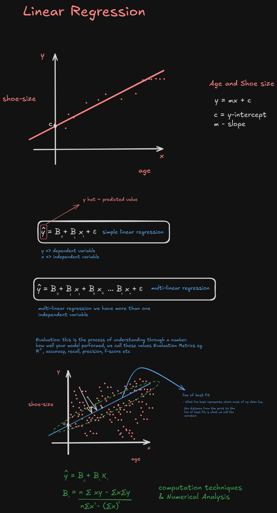
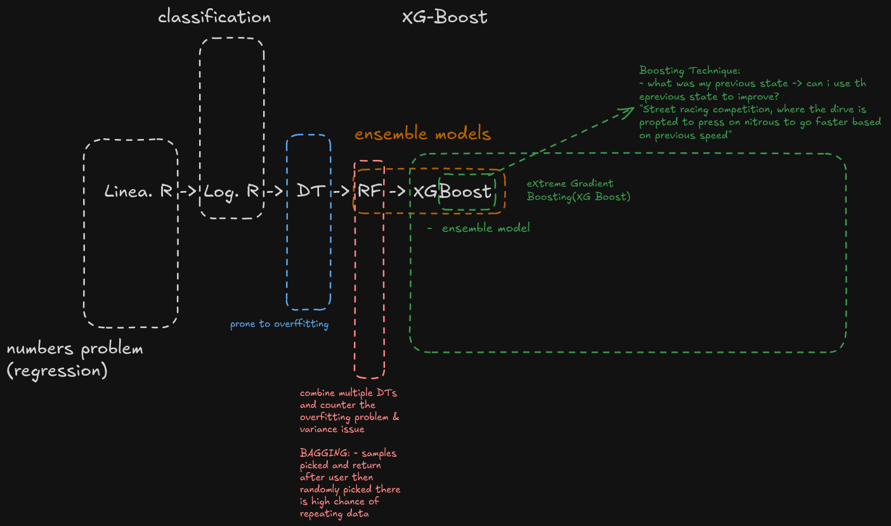

# Start here
- [Download Python from here ](https://www.python.org/downloads/)
- We create **virtual environment** with the aim of isolating your python projects. There other techniques of isolationg your projects:
    - Docker
    - Kubernetes

## creating a virtual Environment: 
- create folder > open the folder on visual studio
- open terminal via visual studio
- run this: `python -m venv env` , kindly note `env` is the name of your environment
- to activate the environment:
    - on windows: 
        - approach one:
            - open `command prompt` on vs code
            - navigate to envrionment folder i.e `env` > open the `Scripts`
            - find `activate.bat` file 
            - click...hold and drag to the terminal space
            - press enter

        - approach 2: 
            - open `command prompt` on vs code
            - run this: `.\env\Scripts\activate.bat` 
            - press enter

    - for linux/ macos:
            - open terminal on vs code
            - run: `source env/bin/activate`

## Finally:
- Create a `.gitignore` file : it makes sure that you only version control what is meant to be version controlled


- install `scikit-learn`: `pip install -U scikit-learn` (make sure your environment is activated)

- install seaborn: `pip install seaborn`


## Linear Regression



## Descision Trees(DT)

<details>
<summary>Class Visuals</summary>

</details>

<details>
<summary>Notes</summary>

## 1. Warm-up: decision logic as a tree

Before formalizing, decision trees are just nested `if / elif / else` logic, visualized as a graph.

**Example: should I carry an umbrella?**

```
Is it raining?
├── yes → carry an umbrella
└── no  → do not carry umbrella, dress warm
           ├── ...is it cold? → dress warm
           └── ...else        → dress in a neutral manner
```

This is the intuition a decision tree formalizes: a sequence of yes/no (or true/false) questions that narrow down to an outcome.

---

## 2. What is a Decision Tree (DT)?

A **Decision Tree** is a supervised learning algorithm that resembles a binary tree. It **recursively splits the dataset** until no further split is possible.

- A node that cannot be split further is called a **pure leaf node**.
- DTs are a **non-parametric model** (see §6).

### Tree terminology

| Term | Meaning |
|---|---|
| **Root node** | The starting node - represents the whole dataset before any split |
| **Decision node** | An internal node that applies a condition (e.g. `age > 18`) and branches |
| **Leaf / terminal node** | A node that is not split further - gives the final outcome |
| **Decision rule** | The condition used to split a node (e.g. `age > 18`) |

**Example: "can I get a driver's license?"**

```
                    condition: age > 18
                    /                  \
                 yes                    no
                  /                       \
          check driving license    check driving license
             /            \              /            \
          yes             no          yes              no
      go to driving    (repeat      drive           go to driving
        school          test)                          school
```

Each ellipse = a node. Each branch = the outcome of applying the decision rule at the node above it.

---

## 3. How does the model choose a split?

At every node, the model effectively asks:

> **"How do I split the data efficiently?"**

This is answered by a **decision rule** - a threshold or condition on one feature (e.g. `age > 18`) - chosen to best separate the data.

To judge whether a decision rule is *good*, we ask:

> **"Given the 'chaos' of the data, does my decision rule get close to the accurate outcome?"**

This is measured using:

- **Entropy** (or **Gini impurity**) - a measure of "chaos" / impurity in a node
- **Information Gain** - how much entropy is reduced by applying a given decision rule

**To check whether a decision rule is the best one, we calculate its information gain** and compare it against the alternatives - the rule with the highest information gain is chosen at that node.

---

## 4. Overfitting vs. Underfitting

Two failure modes, sitting at opposite ends of "how much the model learns from the data":

| | Underfitting | Overfitting |
|---|---|---|
| **What's happening** | Model has learned too little about the data - barely better than no learning at all | Model has learned the training data *too* well, including its noise - "knows the entire data too well to make a mistake" |
| **Symptom** | Poor performance even on training data | Great performance on training data, poor performance on new/unseen data |
| **Direction on the spectrum** | "Learning less about your data" | "Learning more about your data" |

```
underfitting  <────────────────────────────────────→  overfitting
    0%              (sweet spot)                        100%
       learning less about your data   learning more about your data
```

> **Note for next pass:** this spectrum is a useful intuition, but it's worth pairing with a concrete knob - e.g. `max_depth` or `min_samples_leaf` in a decision tree - so students see *what* is actually moving them along this axis, rather than treating it as an abstract dial.

**Scenarios sketched in class (1, 2, 3):** these were meant to be worked examples of the same dataset fit at different tree depths - a good one to build out fully next time to make the curve concrete rather than abstract.

---

## 5. Pruning

**Pruning** = removing a particular sub-node (branch) from a fully grown tree.

- Purpose: combat overfitting by simplifying the tree after it's built (or limiting its growth as it's built).
- A fully unpruned tree tends to overfit; pruning trades a little training accuracy for better generalization.

---

## 6. Parametric vs. Non-Parametric models

### Parametric models
- Assume a **fixed function form** for the relationship between inputs and outputs, described by a **fixed, finite number of parameters**.
- Once trained on the data, the model **no longer needs the data** - everything it learned is compressed into those fixed parameters.

**Examples:**
- Regression models (e.g. Multi-Linear Regression: `y = B₀ + B₁X₁ + B₂X₂ + ... + BₙXₙ + ε`)
- Linear Discriminant Analysis
- Perceptrons

### Non-parametric models
- **No fixed number of parameters** - the model does not assume a fixed functional relationship between inputs and outputs.
- The number of "parameters" (effectively) can grow with the data. The training data itself stays important - the model references back to it.

**Examples:**
- Tree-based models (Decision Trees)
- KNN
- SVM

> **Flag to double-check:** Naive Bayes was grouped with non-parametric models in the sketch, but it's usually classified as **parametric** - it estimates a fixed set of parameters (class priors + per-feature likelihood parameters) that doesn't grow with more training data, unlike KNN or decision trees. Worth revisiting/moving it, or noting the classification is debated if you want to keep it as a discussion point.
>
> SVM's classification as non-parametric is also somewhat contested (defensible for kernel SVMs where support vectors can scale with data, less so for a plain linear SVM) - might be worth a one-line caveat when presenting.

---

## Suggested flow for next time
1. If/elif/else -> tree intuition (umbrella example)
2. Formal tree terminology (root / decision / leaf / decision rule)
3. How splits are chosen (entropy, information gain)
4. Over/underfitting, tied to a concrete hyperparameter
5. Pruning as the fix
6. Parametric vs. non-parametric, with the corrected examples above
</details>


## Useful links:
[Scatter plot with seaborn](https://seaborn.pydata.org/tutorial/relational.html)
[Elcit Linear regressoin assumptions research](https://elicit.com/find-papers/fbc0f128-e3bd-4207-ba5c-5d0ae1df52ac)


